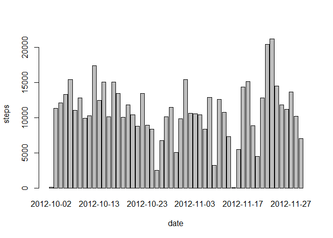

# Reproducible Research: Peer Assessment 1
Mark Ching  
## Loading necessary libraries and set options

```r
setwd('C:\\Users\\diablo\\Desktop\\Coursera\\Reproducible_Research_Peer_Assessment_1\\RepData_PeerAssessment1')
library(knitr)
library(data.table)
library(xtable)
library(ggplot2)
opts_chunk$set(echo = TRUE, results = 'hold')
```

## Loading and preprocessing the data 

1. Unzip and read the data

```r
unzip("activity.zip")
activity <- read.csv("activity.csv",
                         header=TRUE,  na.strings="NA",
                         colClasses=c("numeric", "character", "numeric"))
```
2. Preprocess the data, convert to the proper format

```r
        activity$inteval <- factor(activity$interval)
        activity$date <- as.Date(activity$date, format="%Y-%m-%d")
```
3. Preview the data read

```r
        head(activity)
```

```
##   steps       date interval inteval
## 1    NA 2012-10-01        0       0
## 2    NA 2012-10-01        5       5
## 3    NA 2012-10-01       10      10
## 4    NA 2012-10-01       15      15
## 5    NA 2012-10-01       20      20
## 6    NA 2012-10-01       25      25
```
4. Show data summary

```r
xt <- xtable(summary(activity))
print(xt, type = "html")
```

<!-- html table generated in R 3.1.1 by xtable 1.7-4 package -->
<!-- Sun Oct 19 21:38:25 2014 -->
<table border=1>
<tr> <th>  </th> <th>     steps </th> <th>      date </th> <th>    interval </th> <th>    inteval </th>  </tr>
  <tr> <td align="right"> 1 </td> <td> Min.   :  0.00   </td> <td> Min.   :2012-10-01   </td> <td> Min.   :   0.0   </td> <td> 0      :   61   </td> </tr>
  <tr> <td align="right"> 2 </td> <td> 1st Qu.:  0.00   </td> <td> 1st Qu.:2012-10-16   </td> <td> 1st Qu.: 588.8   </td> <td> 5      :   61   </td> </tr>
  <tr> <td align="right"> 3 </td> <td> Median :  0.00   </td> <td> Median :2012-10-31   </td> <td> Median :1177.5   </td> <td> 10     :   61   </td> </tr>
  <tr> <td align="right"> 4 </td> <td> Mean   : 37.38   </td> <td> Mean   :2012-10-31   </td> <td> Mean   :1177.5   </td> <td> 15     :   61   </td> </tr>
  <tr> <td align="right"> 5 </td> <td> 3rd Qu.: 12.00   </td> <td> 3rd Qu.:2012-11-15   </td> <td> 3rd Qu.:1766.2   </td> <td> 20     :   61   </td> </tr>
  <tr> <td align="right"> 6 </td> <td> Max.   :806.00   </td> <td> Max.   :2012-11-30   </td> <td> Max.   :2355.0   </td> <td> 25     :   61   </td> </tr>
  <tr> <td align="right"> 7 </td> <td> NA's   :2304   </td> <td>  </td> <td>  </td> <td> (Other):17202   </td> </tr>
   </table>

## What is the mean total number of steps taken per day?

1. Aggregate date by date and Plot a histogram of the total number of steps taken each day


```r
steps.date <- aggregate(steps ~ date, data=activity, FUN=sum)
barplot(steps.date$steps, names.arg=steps.date$date, xlab="date", ylab="steps")
```

 

2. Calculate and report the **mean** and **median** total number of
   steps taken per day


```r
mean(steps.date$steps)
median(steps.date$steps)
```

```
## [1] 10766.19
## [1] 10765
```

## What is the average daily activity pattern?

1. Make a time series plot (i.e. `type = "l"`) of the 5-minute
   interval (x-axis) and the average number of steps taken, averaged
   across all days (y-axis)


```r
steps.interval <- aggregate(steps ~ interval, data=activity, FUN=mean)
plot(steps.interval, type="l")
```

 

2. Which 5-minute interval, on average across all the days in the
   dataset, contains the maximum number of steps?


```r
steps.interval$interval[which.max(steps.interval$steps)]
```

```
## [1] 835
```


## Imputing missing values

1. Calculate and report the total number of missing values in the
   dataset (i.e. the total number of rows with `NA`s)


```r
sum(is.na(activity))
```

```
## [1] 2304
```

2. Devise a strategy for filling in all of the missing values in the
   dataset. The strategy does not need to be sophisticated. For
   example, you could use the mean/median for that day, or the mean
   for that 5-minute interval, etc.

Using the mean value  for the 5-minute intervals to fill in as the missing
values .

3. Create a new dataset that is equal to the original dataset but with
   the missing data filled in.


```r
activity <- merge(activity, steps.interval, by="interval", suffixes=c("",".y"))
nas <- is.na(activity$steps)
activity$steps[nas] <- activity$steps.y[nas]
activity <- activity[,c(1:3)]
```

4. Make a histogram of the total number of steps taken each day and
   Calculate and report the **mean** and **median** total number of
   steps taken per day. Do these values differ from the estimates from
   the first part of the assignment? What is the impact of imputing
   missing data on the estimates of the total daily number of steps?


```r
steps.date <- aggregate(steps ~ date, data=activity, FUN=sum)
barplot(steps.date$steps, names.arg=steps.date$date, xlab="date", ylab="steps")
```

 

```r
mean(steps.date$steps)
median(steps.date$steps)
```

```
## [1] 10766.19
## [1] 10766.19
```

The impact of the missing data shifted the median of the data closer towards the mean value, but there is little impact when
estimating the total number of steps per day.


## Are there differences in activity patterns between weekdays and weekends?

1. Create a new factor variable in the dataset with two levels --
   "weekday" and "weekend" indicating whether a given date is a
   weekday or weekend day.


```r
daytype <- function(date) {
    if (weekdays(as.Date(date)) %in% c("Saturday", "Sunday")) {
        "weekend"
    } else {
        "weekday"
    }
}
activity$daytype <- as.factor(sapply(activity$date, daytype))
```

2. Make a panel plot containing a time series plot (i.e. `type = "l"`)
   of the 5-minute interval (x-axis) and the average number of steps
   taken, averaged across all weekday days or weekend days
   (y-axis).


```r
par(mfrow=c(2,1))
for (type in c("weekend", "weekday")) {
    steps.type <- aggregate(steps ~ interval,
                            data=activity,
                            subset=activity$daytype==type,
                            FUN=mean)
    plot(steps.type, type="l", main=type)
}
```

 
## Conclusion:

In the graph above, the activities on the weekday has the highest peak from all steps intervals. In the weekends, the activities has shown more peaks over a hundred than the weekdays.  In addition, we see that the weekend has a higher activities spread along the time.

